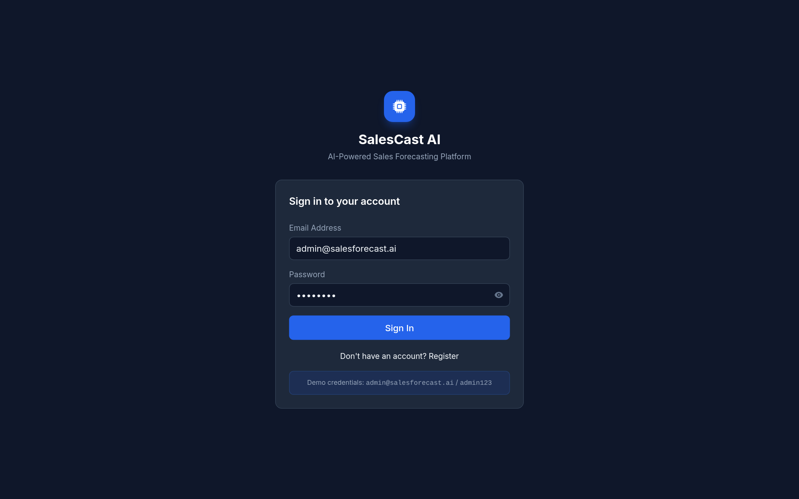
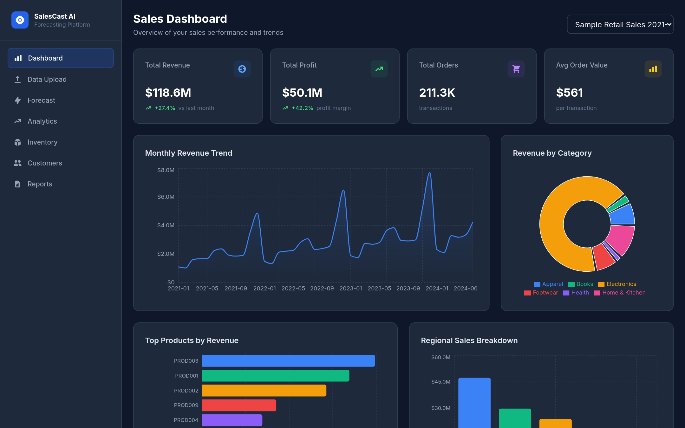
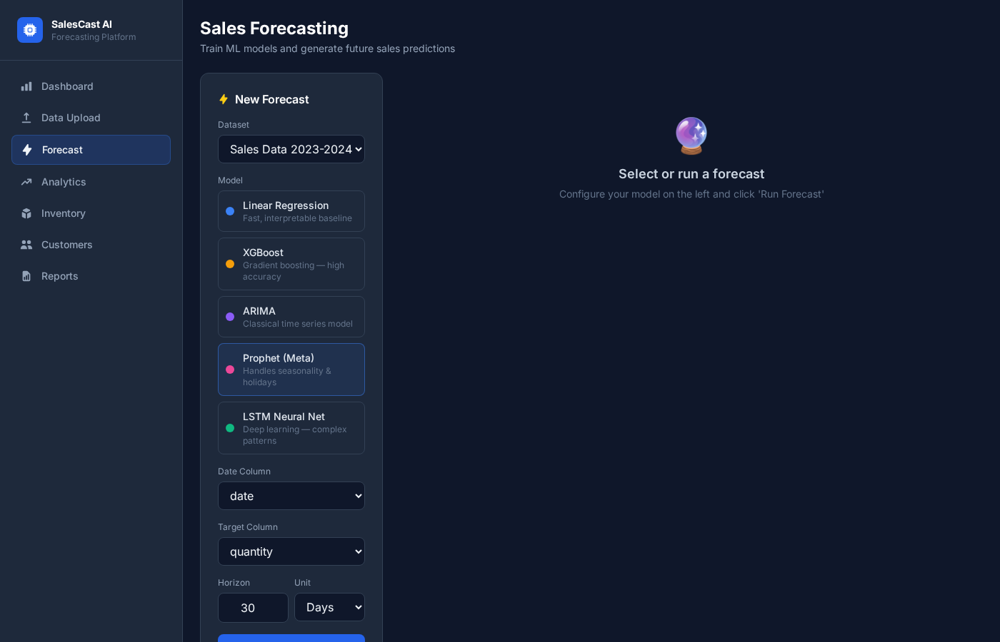
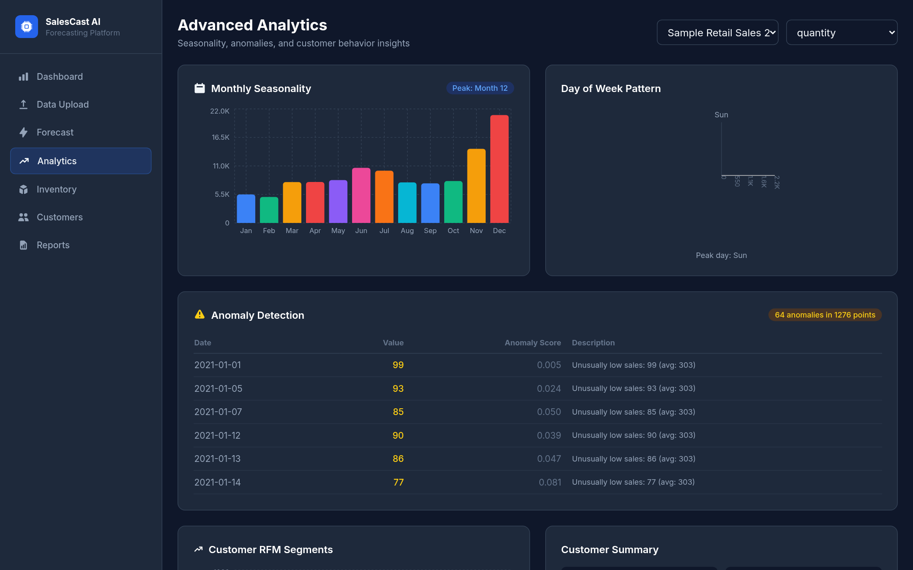
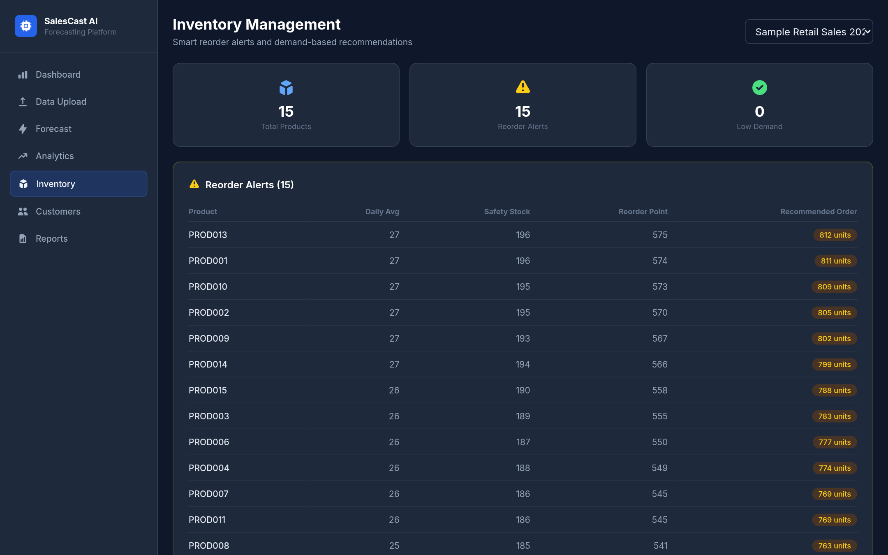
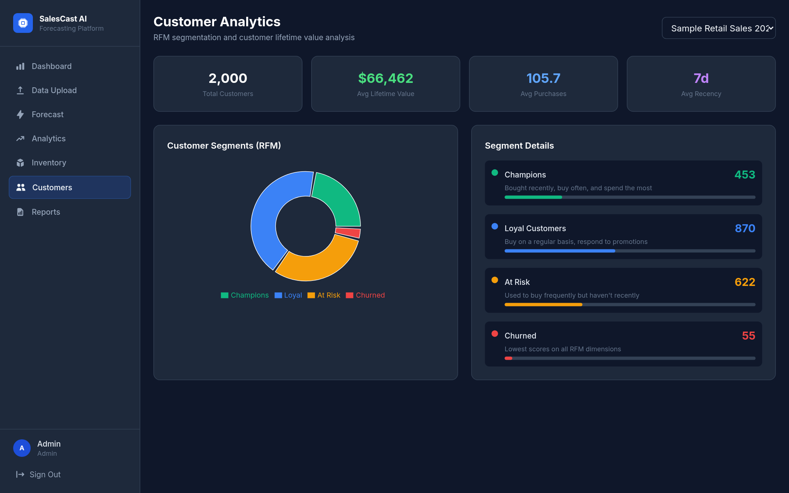
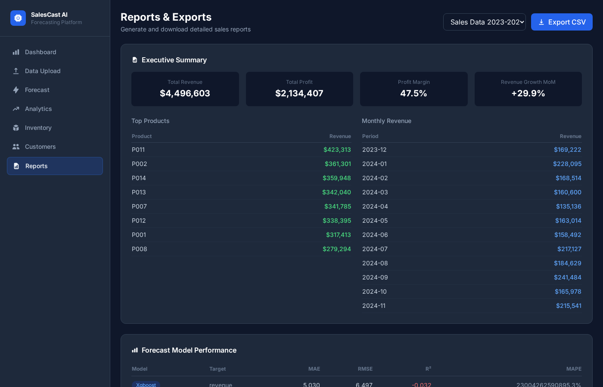
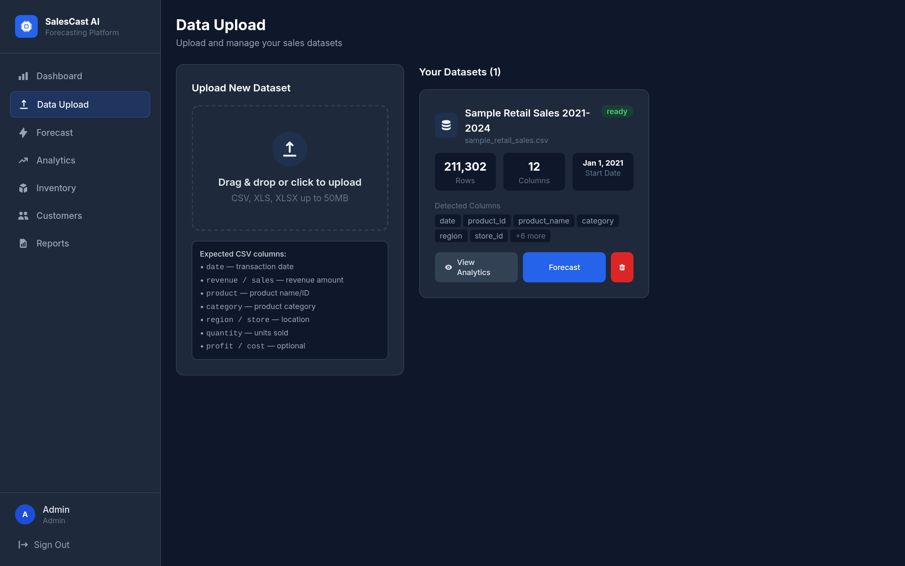

<div align="center">
  

  <h1>SalesCast AI — Sales Forecasting System</h1>

  <p>
    An AI-powered, full-stack sales forecasting platform with five ML models,<br/>
    interactive analytics, anomaly detection, inventory management, and RFM customer segmentation.
  </p>

  <p>
    
    
    
    
    
    
  </p>

  <p>
    <a href="https://dose-linda-earliest-leon.trycloudflare.com" target="_blank">
      
    </a>
  </p>

  <p><strong>Demo credentials:</strong> <code>admin@salesforecast.ai</code> / <code>admin123</code></p>
</div>

---

## Screenshots

### Dashboard
> Real-time KPIs, monthly revenue trends, category breakdown, and regional sales.



---

### Sales Forecasting
> Choose from 5 ML models, configure horizon & target column, and run background training jobs.



---

### Advanced Analytics
> Monthly seasonality bars, day-of-week radar, Isolation Forest anomaly detection table.



---

### Inventory Management
> Demand-based reorder alerts with safety stock, reorder points, and recommended order quantities.



---

### Customer Analytics (RFM)
> RFM segmentation — Champions, Loyal, At Risk, and Churned — with lifetime value stats.



---

### Reports & Exports
> Executive summary, model performance comparison table, and one-click CSV export.



---

### Data Upload
> Drag-and-drop CSV/XLSX upload with auto column detection and dataset management.



---

## Features

| Module | What it does |
|---|---|
| **Dashboard** | Revenue, profit, orders, AOV, monthly trend chart, category donut, regional bar |
| **Forecasting** | Train Linear Regression, XGBoost, ARIMA, Prophet, or LSTM; poll job status; view predictions |
| **Analytics** | Seasonality patterns, anomaly detection (Isolation Forest), day-of-week radar |
| **Inventory** | Safety stock & reorder point calculation, demand-based order recommendations |
| **Customers** | RFM scoring with quartile binning; segment pie + detail cards |
| **Reports** | Executive summary, model metrics table (RMSE, MAE, R², MAPE), CSV export |
| **Data Upload** | Async file upload, column detection, multi-dataset support |

---

## ML Models

| Model | Best for | Notes |
|---|---|---|
| **Linear Regression** | Fast baseline | Ridge regularisation, cyclical + lag features |
| **XGBoost** | Tabular accuracy | Feature importance, handles non-linearity well |
| **ARIMA** | Stationary series | Auto ARIMA(2,1,2), classical time-series |
| **Prophet** | Trend + seasonality | Meta's Prophet, handles holidays & changepoints |
| **LSTM** | Complex patterns | TensorFlow/Keras, 30-day lookback window, CPU |

---

## Tech Stack

```
Frontend   React 18 · Vite 5 · Tailwind CSS 3 · Recharts · React Query · react-hot-toast
Backend    FastAPI · SQLAlchemy (async) · asyncpg · Pydantic v2 · python-jose (JWT)
ML         Pandas · Scikit-learn · XGBoost · Prophet · TensorFlow-CPU · Statsmodels
Database   PostgreSQL 15 (asyncpg driver)
Infra      Docker · docker-compose · Nginx (reverse proxy)
```

---

## Quick Start

### Docker (recommended)

```bash
git clone https://github.com/aasimansari1/Sales-Forecasting-System.git
cd Sales-Forecasting-System
cp backend/.env.example backend/.env   # edit DATABASE_URL if needed
docker-compose up --build
```

Open **http://localhost** — API docs at **http://localhost/docs**

### Local Dev

**Backend**
```bash
cd backend
python3 -m venv .venv && source .venv/bin/activate
pip install -r requirements.txt
cp .env.example .env                   # edit DATABASE_URL
uvicorn app.main:app --reload --port 8000
```

**Frontend**
```bash
cd frontend
npm install
npm run dev                            # http://localhost:5173
```

**Sample data**
```bash
cd data
python3 generate_sample_data.py        # generates 211k-row sample_retail_sales.csv
```
Upload the CSV via the **Data Upload** page to start forecasting.

---

## Default Credentials

| Field | Value |
|---|---|
| Email | `admin@salesforecast.ai` |
| Password | `admin123` |

---

## Expected CSV Format

| Column | Description |
|---|---|
| `date` | Transaction date (YYYY-MM-DD) |
| `revenue` / `sales` | Revenue amount |
| `product_name` / `product_id` | Product identifier |
| `category` | Product category |
| `region` | Geographic region |
| `store_id` | Store identifier |
| `customer_id` | Customer ID (used for RFM) |
| `quantity` | Units sold |
| `profit` / `cost` | Optional |

---

## Project Structure

```
sales-forecasting/
├── backend/
│   ├── app/
│   │   ├── main.py              # FastAPI app entry point
│   │   ├── routes/              # auth, upload, forecast, analytics
│   │   ├── services/            # ml_service, analytics_service, data_processor
│   │   ├── models/              # SQLAlchemy ORM models
│   │   └── utils/               # JWT auth helpers
│   ├── requirements.txt
│   └── Dockerfile
├── frontend/
│   ├── src/
│   │   ├── pages/               # Dashboard, Forecast, Analytics, Inventory, Customers, Reports
│   │   ├── components/          # Sidebar, Charts, MetricCard, FileUpload
│   │   ├── context/             # AuthContext (JWT + user state)
│   │   └── services/            # Axios API client
│   ├── vite.config.js
│   └── Dockerfile
├── data/
│   └── generate_sample_data.py  # Generates 211k retail sales records (2021–2024)
├── nginx/
│   └── nginx.conf               # Reverse proxy: /api → backend, /* → frontend
├── docs/screenshots/            # App screenshots
└── docker-compose.yml
```

---

## License

MIT
